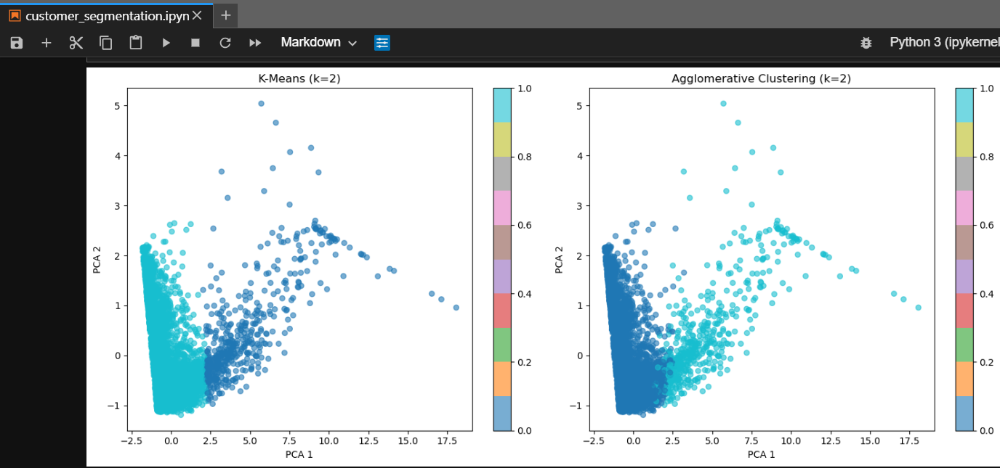

# Сегментация клиентов интернет-магазина (Online Retail)

Полный ML-пайплайн: предобработка, RFM-инжиниринг, подбор числа кластеров, обучение моделей кластеризации и бизнес-интерпретация результатов.

## Задача

Выделить сегменты клиентов на основе транзакционного поведения (RFM-метрики: Recency, Frequency, Monetary) для точечных маркетинговых кампаний вместо массовых рассылок.

## Данные

[Online Retail II (UCI)](https://www.kaggle.com/datasets/mashlyn/online-retail-ii-uci) — реальные транзакции британского e-commerce (~1 млн строк).

## Что сделано

- Очистка: пропуски, дубликаты, отмены заказов, отрицательные значения, выбросы (99-й перцентиль)
- RFM-инжиниринг: агрегация транзакций в клиентские профили
- Подбор оптимального числа кластеров (метод локтя, силуэт)
- Кластеризация: K-Means и Agglomerative Clustering
- Визуализация через PCA
- Оценка качества: Silhouette Score, Calinski-Harabasz, Davies-Bouldin
- Интерпретация сегментов и рекомендации для бизнеса

## Результат

Выделены 2 сегмента:
- **VIP-клиенты (8.6%)** — ключевой сегмент, обеспечивающий основную выручку
- **Уходящие клиенты (91.4%)** — «спящая» аудитория, требующая реактивации

## Стек

Python, pandas, NumPy, scikit-learn, Matplotlib, Seaborn

## Структура

- `customer_segmentation.ipynb` — основной ноутбук с кодом и выводами
- `online_retail_II.csv` — датасет (скачать по ссылке выше и поместить в папку с ноутбуком)
